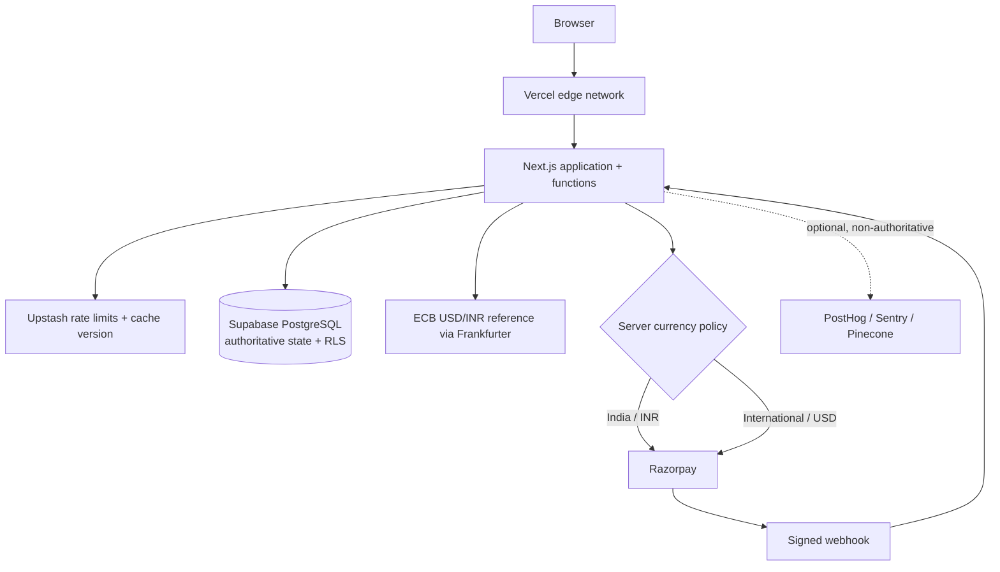

# MYDAY

MYDAY is a public record where people pay a platform fee to attach meaning to a calendar date. One verified claim is current per day; a higher valid claim can replace it while history remains. It is not an investment, resale market, wallet, security, or promise of financial return.

The product is a responsive, light-first editorial Next.js application with public leaderboards, exploration, search, profiles, date monuments, anonymous purchasing, and server-verified Razorpay checkout for domestic and enabled international cards.

## Product rules

- Any valid past, present, or future calendar date can be claimed.
- PostgreSQL—not the browser, a redirect, a cache, or a provider dashboard—is authoritative.
- One partial unique index permits only one `current` claim per date.
- The default opening claim is USD 1. The next claim is the current amount plus the greater of 10% or USD 1; configuration lives in PostgreSQL.
- A public attribution must be an `@handle` or complete HTTPS URL. Public, unlisted, and private visibility are enforced in database views and RLS.
- Payment grants a platform record only. There are no payouts, withdrawals, wallets, resale, or guaranteed returns.

## Architecture



| Service | Responsibility | Failure behavior |
| --- | --- | --- |
| Vercel | Next.js hosting, CDN, TLS, functions, and edge controls | Health alerts; authoritative data remains in Supabase |
| Next.js | UI, validation, anonymous checkout orchestration, webhook endpoints | Clean errors; no ownership guess |
| Supabase PostgreSQL | Anonymous buyer records, RLS, claims, history, payments, audit log, transactions | Claims and checkout fail closed |
| Upstash | Distributed abuse limits and public cache generation | Production writes fail closed; public reads fall through to Supabase |
| Razorpay | INR and enabled international payment collection, signed events, refunds | No ownership until a valid webhook transaction commits |
| Frankfurter/ECB | Latest daily USD/INR reference used for Indian checkout | INR checkout fails closed if a recent rate cannot be verified |
| PostHog/Sentry/Pinecone | Optional analytics, errors, derived semantic index | Core flow continues; lexical PostgreSQL search remains available |

The application is stateless. Let Vercel scale the Next.js functions and CDN; do not add microservices or multiple database regions until measurements justify them.

## Local setup

Requirements: Node.js 22.13+ and npm.

```bash
npm install
copy .env.example .env.local
npm run dev
```

Preview records are allowed only when `MYDAY_ENABLE_PREVIEW_DATA=true` and never in production. With placeholder credentials, public preview pages work while checkout shows a safe unavailable state.

Verification:

```bash
npm run typecheck
npm run lint
npm test
npm run build
```

## Environment variables

Public browser values: `NEXT_PUBLIC_APP_URL`, `NEXT_PUBLIC_SUPABASE_URL`, `NEXT_PUBLIC_SUPABASE_PUBLISHABLE_KEY`. Only the optional PostHog project key/host may also be public.

Server-only secrets: `SUPABASE_SERVICE_ROLE_KEY`, Upstash credentials, Razorpay keys/webhook secret, `SENTRY_DSN`, and Pinecone credentials. `SUPABASE_DB_URL` is migration-only and must not be available to the runtime. Store secrets in encrypted platform storage, never Git. `/ready` returns 503 until Supabase, Upstash, and Razorpay are completely configured.

## Supabase and anonymous checkout

1. Create a Supabase project and apply `supabase/migrations` in filename order with an elevated migration connection. Seed only development with `supabase/seed.sql`.
2. Apply `202608260005_anonymous_checkout.sql` after the original four migrations when upgrading an existing database.
3. Do not configure a password, social-login, or third-party-auth system; purchasing and public discovery do not require an account.

The server creates a deterministic internal buyer record from the normalized submitted attribution. The internal identifier exists only to preserve claim and audit foreign keys; public pages show the submitted attribution. Anonymous checkout RPCs are service-role-only, status lookup requires the checkout's unguessable access key, tables force RLS, and public views omit private payment state. See `docs/identity-and-rls.md`.

## Upstash and Vercel

Create a REST-enabled Upstash Redis database and provide its URL/token. Checkout rate-limit keys use a one-way request fingerprint and fail closed without Redis in production. Cache invalidation is best-effort after commit; cache never determines ownership.

For Vercel, import the GitHub repository as a Next.js project. Add all environment values through Vercel Project Settings, bind the custom domain, enforce HTTPS, enable firewall controls, and verify `/health`, `/ready`, CSP/HSTS, logs, and webhooks after deployment. Never place production secrets in build arguments or public variables.

## Payments

The client supplies a validated billing country, never a provider name. Every checkout uses Razorpay. `IN` creates an INR order using a recent server-fetched ECB USD/INR reference; other supported countries create a USD order. The canonical claim value remains in USD minor units. Configure:

- Razorpay webhook: `POST /api/webhooks/razorpay`, event `payment.captured`; enable automatic capture.

International payments require Razorpay dashboard approval, completed KYC, the site policy pages, and international cards enabled for the account. The app cannot bypass that account-level approval. If the daily FX feed or secure database refresh fails, INR checkout stops instead of using a client or stale unverified rate.

Handlers read the bounded raw body, verify signatures/replay windows, and call `finalize_verified_claim`. That transaction locks the intent and date, validates price/currency/provider/version, records a unique event/payment, supersedes the old claim, and commits one new current claim. A stale verified payment enters an idempotent refund path. Redirect pages only poll server state. See `docs/payments-and-claims.md`.

## Optional integrations

- PostHog: create a project, set the public key/host, implement consent-aware event capture, and exclude stories, attribution URLs, identity tokens, and payment details. It must never gate the claim path.
- Sentry: set a server DSN and configure source maps through encrypted CI secrets. Redact headers, cookies, request bodies, profile content, and payment identifiers before enabling transport.
- Pinecone: create a derived public-claim index keyed by claim id. Index only public title/story/date after the database commit through an idempotent bounded worker. Delete/update on visibility change. If unavailable, use existing bounded PostgreSQL lexical search.

These adapters are deliberately disabled without credentials and privacy configuration; the production readiness endpoint does not depend on them.

## Caching, scaling, and degraded behavior

Anonymous public GET responses use short shared caching (`s-maxage=60`, stale-while-revalidate 300). All API, checkout, and payment paths are `private, no-store`. Supabase queries are bounded. Public cache generations change after authoritative claims.

Critical dependencies fail closed: invalid payment signatures do nothing; database/permission uncertainty reveals no private payment data; checkout provider failure records a safe failure. Optional analytics/search failures do not affect claims. `/maintenance` explains a deliberate pause; `/health` is liveness and `/ready` is configuration readiness without infrastructure details.

Graceful shutdown is delegated to the Vercel function lifecycle: handlers hold no in-memory authoritative state, database clients are request-safe HTTP clients, and no local queue/connection requires SIGTERM cleanup. Background work must use a deployment-compatible durable mechanism with bounded retries, jitter, idempotency, and a dead-letter procedure before it is introduced.

## Operations, load, backup, and recovery

Run the safe local public check with `npm run load:public`; configure its bounded environment values as described in `load/README.md`. Same-date races, anonymous checkout bursts, and webhook bursts must run only in an isolated staging project with provider test mode. Assert one current claim, unique provider events, bounded p95/p99, and no exhausted database connections.

Enable Supabase scheduled backups/PITR appropriate to business requirements and test restoration quarterly into an isolated project. Export payment/audit reconciliation data according to retention policy. Recovery, outage, alerting, secret rotation, and restore steps are in `docs/operations.md`.

## CI/CD and production deployment

`.github/workflows/ci.yml` uses read-only permissions, pinned action SHAs, locked npm dependencies, a production dependency audit, typecheck, lint, tests, and build. Protect the production environment, require reviews, use short-lived deployment credentials, and never expose provider secrets to pull-request builds.

Deployment order:

1. Verify and back up the target Supabase project; apply migrations.
2. Configure Upstash, test-mode Razorpay webhooks, and hosted secrets.
3. Run the full verification suite and staging race/replay tests.
4. Deploy a protected Vercel preview, verify health/readiness/security headers and smoke tests, then promote the verified build to production.
5. Switch payment providers to live keys only after webhook reconciliation and rollback exercises succeed.

## Security checklist

- [ ] No real secret is tracked or present in client bundles/build logs; rotate anything ever committed.
- [ ] RLS policies and grants are applied and tested with anon and service role; old authenticated checkout grants are revoked.
- [ ] Mutation origins, anonymous status access keys, webhook signatures, replay handling, and event idempotency are verified.
- [ ] Same-date concurrency leaves exactly one current claim; stale captures are reconciled/refunded.
- [ ] CORS/origin rules, request sizes, validation, rate limits, CSP, HSTS, frame denial, and no-store paths are verified on the deployed host.
- [ ] Provider dashboards use MFA, least privilege, alerts, live/test isolation, and secret rotation ownership.
- [ ] Dependency audit, pinned CI actions, branch protection, backup restore drill, incident contacts, and monitoring alerts are current.
- [ ] Public/private/unlisted behavior is tested for leaderboard, search, profiles, dates, activity, sitemap, and cache keys.
- [ ] Accessibility keyboard, focus, contrast, reduced motion, mobile layouts, print output, empty/error/loading states are checked before release.

The code review record and remaining dashboard-side controls are documented in `docs/security-review.md`.
